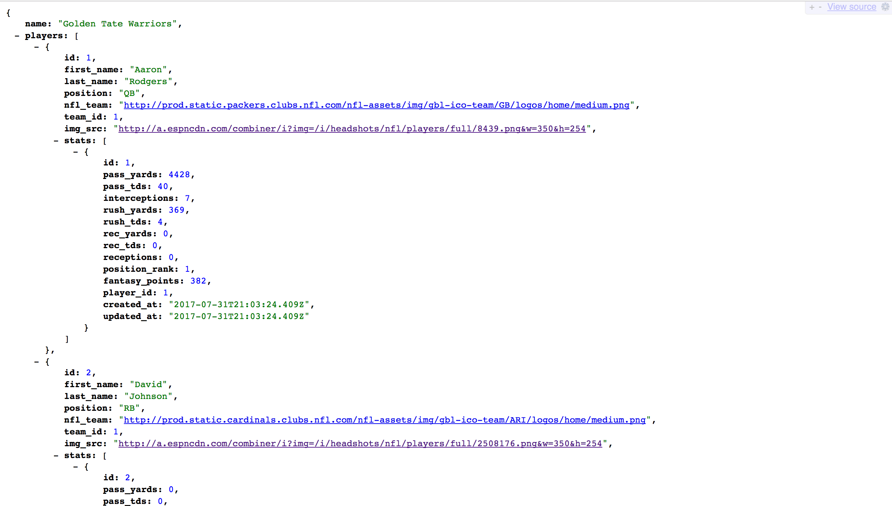

# The Intimidation Game

## This app is an API for the [FFTM](https://fftm.herokuapp.com/) application. The return format for all endpoints is JSON.




## Live Version

You can find a live version of this application on Heroku at: https://the-intimidation-game.herokuapp.com/

The root path is set to ```api/v1/players/stats```


### Contributors:
* [Brett Schwartz](https://github.com/bschwartz10)

## Setup

To set up a local copy of this project, perform the following:

Clone the repo in your terminal:
```
git clone https://github.com/bschwartz10/the_intimidation_game.git
```

Navigate into the project:
```
cd the_intimidation_game
```
Bundle:
```
bundle install
```

Create, migrate, and seed your database:
```
rake db:create
rake db:migrate
rake db:seed
```

Run `rspec` in your terminal to ensure all tests are passing.

## Endpoints
You can visit these endpoints to see a JSON response.

In your terminal, start a local server: `rails s`

Open your browser to `localhost:3000`

### Team Endpoints (Index and Show)

- **<code>GET</code> /api/v1/teams/teams**
- **<code>GET</code> /api/v1/teams/teams/:id**

### Players Endpoints(Index and Show)
- **<code>GET</code> /api/v1/players/stats**
- **<code>GET</code> /api/v1/players/stats/:id**
